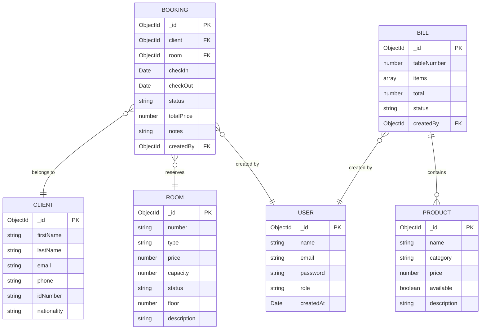

# System Diagrams
## Hotel Management System (2026)

> Diagrams marked **[original]** are from the original design phase and remain accurate for the current system.
> Diagrams marked **[updated]** are new versions that reflect the 2026 tech stack.

---

## 1. Use Case Diagram [original]


---

## 2. Activity Diagrams [original]

### Login


### Manage Rooms


### Receptionist — Register Client
.png)

### Receptionist — Make Booking
.png)

### Receptionist — Cancel Booking
.png)

### Receptionist — View Available Rooms
.png)

### Waiter


### Add Product
.png)

### Edit Product


### Delete Product


### View Finances / Dashboard


---

## 3. State Diagrams [original]

### Hotel Manager


### Receptionist


### Restaurant Manager


### Waiter


---

## 4. Sequence Diagrams [original]

### Login


### Manage Rooms


### Manage Employees
.png)

### Receptionist — Booking


### Receptionist — Client


### Waiter


### Restaurant Manager — View Products
.png)

---

## 5. Collaboration Diagrams [original]

### Login


### Receptionist — Booking
.png)

### Receptionist — Client
.png)

### Manage Employees


### Manage Rooms


### Waiter


---

## 6. Class Diagram [original]

.png)

---

## 7. Data Flow Diagrams [original]

### DFD Level 0


### DFD Level 1


### DFD Level 2


---

## 8. Object Diagram [original]


---

## 9. Database / ER Diagram — MongoDB Collections [updated]

> The original ERD was designed for MySQL. The updated version reflects the MongoDB document model used in the 2026 rebuild.



---

## 10. System Architecture [updated]

> The original Component/Deployment diagrams showed XAMPP + Apache + MySQL. The updated version reflects the 2026 deployment on Vercel + MongoDB Atlas.

```mermaid
graph TB
    subgraph Client ["Browser (Any Device)"]
        UI[Next.js React UI\nTailwind CSS]
    end

    subgraph Vercel ["Vercel (Serverless Cloud)"]
        PAGES[App Router\nPages & Layouts]
        API[API Routes\n/api/*]
        AUTH[NextAuth.js\nJWT Sessions]
    end

    subgraph Atlas ["MongoDB Atlas (Cloud Database)"]
        DB[(MongoDB\nCollections)]
    end

    UI -->|Page navigation| PAGES
    UI -->|fetch() REST calls| API
    PAGES -->|getServerSession| AUTH
    API -->|verify session| AUTH
    API -->|Mongoose ODM| DB
    PAGES -->|Server-side reads| DB
```
